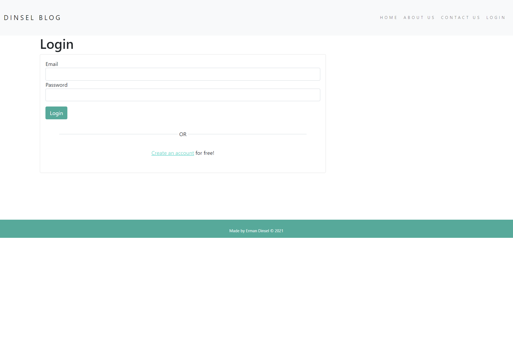
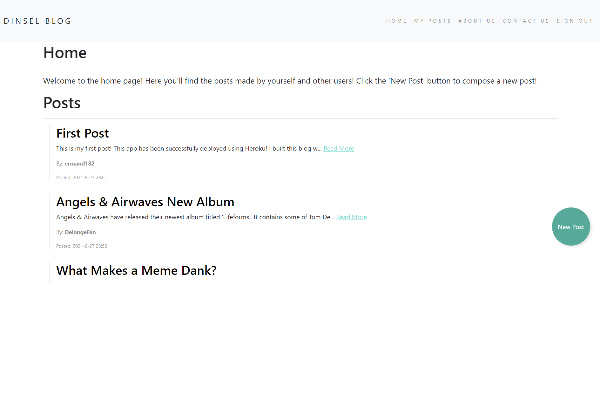

<h1>Dinsel Blog</h1>

This is a blog style website concept made using Node.js, Express.js, Javascript, EJS, CSS, Mongodb. It was deployed using Heroku at <a href="https://dinselblog.herokuapp.com/" target="_blank">dinselblog.herokuapp.com</a>

To use this application, the user must first login or create an account. Feel free to use a made-up email to register an account.

After the user is logged in, they are able to view other users posts in the home screen. By clicking a post's title, the content can be expanded. The user can press the new post button to create their own post. Posts can be deleted by clicking your own post and pressing the red delete button.

